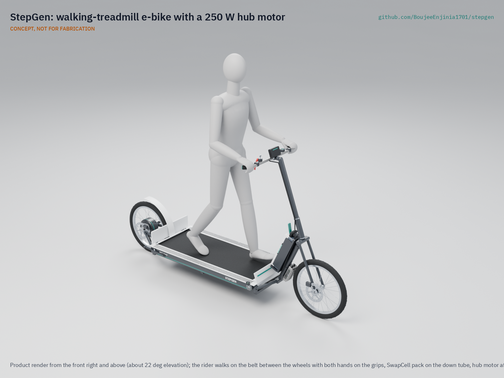

# StepGen

     

**Area:** Mobility and Logistics · **TRL:** 3 of 9 (proof of concept on paper) · **Value-engineering target:** $650 USD on the salvage reference build (estimated cost of the constructable design $610), SwapCell pack excluded · **Difficulty:** 3 of 5

Walking-treadmill vehicle: the rider stands upright and walks at a normal pace on a short free-running belt between the wheels, a belt-speed sensor sets the assist of a 250 W hub motor, and the vehicle moves at e-bike speed (up to 25 km/h) on a shared SwapCell pack. Walking is the control input; the motor does the work.

[Exploded render](media/render-exploded.png) · [Detail render](media/render-detail.png) · [Interactive 3D model](media/viewer.html) · [General arrangement (PDF)](cad/drawings/SGN-DWG-001.pdf) · [Concept blueprint (PDF)](media/concept-blueprint.pdf) · [Sizing note](docs/04-calcs/01-sizing.md) · [Prototype build plan](docs/05-build-plan.md) · [Design decisions](docs/06-design-decisions.md) · [Review note](docs/REVIEW.md)

## Concept rationale

Walking is the one way of moving that almost everyone already knows, so StepGen uses it as the control input instead of asking new riders to learn to pedal and balance on a saddle. The rider walks at an ordinary pace on a free-running belt; a sensor reads that pace and a 250 W hub motor does the propulsion, because a person walking puts only about 30 to 41 W into the belt, far less than the 136 W the vehicle needs at 20 km/h ([SGN-CAL-001](docs/04-calcs/01-sizing.md)). Walking sets the speed, gives light exercise and stops the motor as soon as the rider stops.

Commercial walking bikes exist but cost from about €3,000 and weigh about 55 kg ([Lopifit, "What is a Lopifit?"](https://www.lopifit.com/what-is-a-lopifit/)). StepGen is open hardware so that a local welder or bike mechanic can build it from a salvaged walking-pad treadmill, a donor 20 in bike and common e-bike parts for about $610, share one SwapCell pack with other portfolio vehicles, and adapt the design to the riders they serve.

## Burning platform

The WHO reports that 31 % of adults worldwide did not meet the recommended levels of physical activity in 2022, a share that has risen since 2010 ([WHO, physical activity fact sheet](https://www.who.int/news-room/fact-sheets/detail/physical-activity)). At the same time, populations are ageing: by 2030 one in six people in the world will be aged 60 or over, 1.4 billion people, and by 2050 two-thirds of them will live in low- and middle-income countries ([WHO, ageing and health fact sheet](https://www.who.int/news-room/fact-sheets/detail/ageing-and-health)).

Many of these people make short daily trips that are too long to walk and too costly by car, and e-bikes serve them only if they can already cycle. A vehicle driven by ordinary walking could give non-cyclists and older adults the reach of an e-bike together with daily activity, but only if it is cheap and simple enough to be built and repaired locally.

## Where it could be used

### By industry

| Industry | Use |
| --- | --- |
| Urban mobility and bike share | A pedal-free option in shared fleets for riders who do not cycle |
| Healthy ageing and community services | Errands and clinic visits for older adults who can walk but are nervous on a saddle |
| Workplace and campus mobility | Moving staff across large sites, factories, hospitals and universities at walking effort |
| Tourism and leisure | Rentals on promenades and park paths, where riding a walking bike is itself the attraction |
| Last-mile commuting | The trip between home and a train or bus station for commuters who want light exercise |
| Local fabrication and repair | A product that bike mechanics and welders can build and service from salvaged parts |

### By country or region

| Country or region | Why it matters there |
| --- | --- |
| Netherlands | 27 % of all journeys are made by bicycle and more than half of all car trips are shorter than 7.5 km ([Government of the Netherlands, bicycle policy](https://www.government.nl/topics/bicycles/bicycle-policy-in-the-netherlands)); the Lopifit walking bike was developed here ([Lopifit](https://www.lopifit.com/what-is-a-lopifit/)), so dense cycle infrastructure and a working reference vehicle already exist |
| Japan | 29.1 % of the population was aged 65 or over on 1 October 2023 ([Cabinet Office, Annual Report on the Ageing Society 2024](https://www8.cao.go.jp/kourei/english/annualreport/2024/pdf/2024.pdf)); an upright, walking-paced vehicle suits older adults on short local trips |
| United States | Federal e-bike law assumes operable pedals ([15 USC 2085](https://uscode.house.gov/view.xhtml?req=granuleid%3AUSC-prelim-title15-section2085&num=0&edition=prelim)), so a walking vehicle is a test case for how rules treat pedal-free, low-power assist |
| India | The world's second-largest market for electric two-wheelers, with 2023 sales up 40 % on 2022, and after subsidies an electric two-wheeler cost more than 15 % less than its petrol equivalent ([IEA, Global EV Outlook 2024](https://www.iea.org/reports/global-ev-outlook-2024/trends-in-other-light-duty-electric-vehicles)); buyers already choose light electric vehicles on price, so a low-cost build matters |
| Kenya | One of the countries where UNEP supports electric two- and three-wheeler projects, in a region where motorcycle numbers in many African countries are growing at some of the highest rates in the world ([UNEP, electric two and three wheelers](https://www.unep.org/topics/transport/electric-mobility/electric-two-and-three-wheelers)); a locally built vehicle on a shared SwapCell pack fits that shift, though demand and rules need a desk study |
| Latin America | Two- and three-wheelers play a critical role in daily passenger and commercial transport in Latin America and Africa ([IEA, Global EV Outlook 2024](https://www.iea.org/reports/global-ev-outlook-2024/trends-in-other-light-duty-electric-vehicles)); a light vehicle that local workshops can build and repair could serve the same trips |

## What sparked the idea

The starting point was the electric walking bike that Amish has seen in the Netherlands, of the Lopifit type: the rider walks upright on a treadmill belt between the wheels, and the bike moves forward instead of being pedalled. The Lopifit is a Dutch invention by Bruin Bergmeester, who drove to work, found it hard to keep a healthy weight and decided that should change; the company is based in Utrecht ([Lopifit, "What is a Lopifit?"](https://www.lopifit.com/what-is-a-lopifit/); [Lopifit, "Our story"](https://www.lopifit.com/our-story/)). It shows that a walking vehicle works and can be sold, but its price and mass put it out of reach of many of the people who would gain most from it. StepGen asks whether the same idea can be made light, open and garage-buildable on a shared battery.

## Problem

Many people who would gain from an e-bike never ride one because cycling needs riding skill, balance on pedals and a seated posture that does not suit everyone, while walking is natural and needs none of these. Short trips of 2 to 15 km stay too long to walk and too costly by car. Design with, not for: requirements must come from co-design sessions and field trials with the intended users through a local partner.

## Concept

Walking-treadmill vehicle: the rider stands upright and walks at a normal pace on a short free-running belt between the wheels, a belt-speed sensor sets the assist of a 250 W hub motor, and the vehicle moves at e-bike speed (up to 25 km/h) on a shared SwapCell pack. Walking is the control input; the motor does the work.

Full design precis: [docs/02-concept.md](docs/02-concept.md)

## Key components

- Long-wheelbase welded steel frame (2.38 m long with the fender, 1.86 m wheelbase, 60 x 30 x 2 mm deck rails) with two 20 in wheels
- Free-running treadmill belt on a roller bed, with a one-way bearing in the rear roller so the belt runs rearward only
- Belt-speed sensor that sets the motor assist
- 250 W geared rear hub motor and 48 V controller, assist cut at 25 km/h, 15 km/h beginner mode
- Shared 48 V SwapCell pack (interface v0.3) in a down-tube cradle to latch class V1, woken by a 10 kΩ INTERLOCK coding resistor (pack not in the parts cost)
- Two disc brakes with motor cut-off levers, a lanyard stop switch and a key switch in the SwapCell INTERLOCK loop
- Guards over the belt rollers and the rear tire

TRL 3 sizing ([SGN-CAL-001](docs/04-calcs/01-sizing.md)): about 9.1 Wh/km at 20 km/h, about 45 km per SwapCell pack on the flat, 35.1 kg without the pack, and an estimated $610 in parts excluding the pack on the salvage reference build, $40 under the $650 value-engineering target ($750 with all new parts; see [SGN-DDR-002](docs/decisions/0002-recommendations-accepted.md), [SGN-DDR-003](docs/decisions/0003-design-for-construction.md) and the [review note](docs/REVIEW.md)). The parametric model is `cad/src/model.py`, with STEP files in `cad/step/`.

The priced bill of materials is in [bom/bom.csv](bom/bom.csv).

## Building the prototype

The [prototype build plan](docs/05-build-plan.md) (SGN-BLD-001) shows how to build the first proof-of-concept StepGen, component by component, with a making sketch for every made part, close-ups of the joints and a picture for every assembly step. The frame is welded from stock steel tube and plate; the belt and rollers come from a used walking-pad treadmill and the wheels, brakes and motor are bought. Making the concept buildable changed some parts (rear stays, nose beam, head tube, cradle, guards and fixings) without changing what the vehicle does; the changes are in [SGN-DDR-003](docs/decisions/0003-design-for-construction.md), and decisions still open are in the [design decisions register](docs/06-design-decisions.md). It is a plan: building and testing to it is TRL 4 work.

## Safety

> **Safety:** A rider stands on a moving belt on a moving vehicle. The motor must run only while the rider walks and stop when the belt stops, a brake is pulled or the lanyard comes out. Guard the belt rollers and the rear tire, keep the deck low with open sides, limit speed to 25 km/h, and wear a helmet. The SwapCell pack is a 468 Wh lithium-ion battery held by a class V1 latch; every circuit stays under 60 V DC. This is a paper design at TRL 3; nothing here clears it for building or riding.

## Repository layout

| Folder | Contents |
| --- | --- |
| `docs/` | Problem, concept, requirements, calculations, prototype build plan and design decisions |
| `cad/src/` | build123d Python source, the source of truth for all geometry |
| `cad/step/`, `cad/stl/` | Exported models for FreeCAD, other CAD tools and printing |
| `cad/drawings/` | 2D sketches and dimensioned drawings |
| `bom/` | Bill of materials |
| `electronics/` | KiCad schematics and PCB layouts |
| `firmware/` | Microcontroller code |
| `media/` | Renders, perspectives and photos |
| `build-log/` | Dated prototyping notes |

## Documentation

Controlled documents follow the portfolio [documentation standard](.kit/STANDARDS.md). Each carries a document ID (SGN-PRC-001 for the precis), a version and a revision history. Branded PDFs are built with `python .kit/render.py` and attached to GitHub Releases when a document is tagged, for example `SGN-PRC-001/v1.0`.

## Credits

Designed by Amish Chadha. See [CONTRIBUTORS.md](CONTRIBUTORS.md) for roles. To cite this design, use [CITATION.cff](CITATION.cff) (GitHub shows it as "Cite this repository").

AI assistance (Claude) was used to accelerate concept renders, prototype documentation and first-pass sizing calculations. Design direction and all decisions are Amish Chadha's, recorded in this repository's decision records (`docs/decisions/`).

## Licenses

- **Hardware** (CAD, drawings, BOM, electronics): [CERN-OHL-S v2](LICENSE)
- **Software** (firmware, scripts, notebooks): [MIT](LICENSE-SOFTWARE)

A project of the [Design Molecule](https://designmolecule.com) lab.
