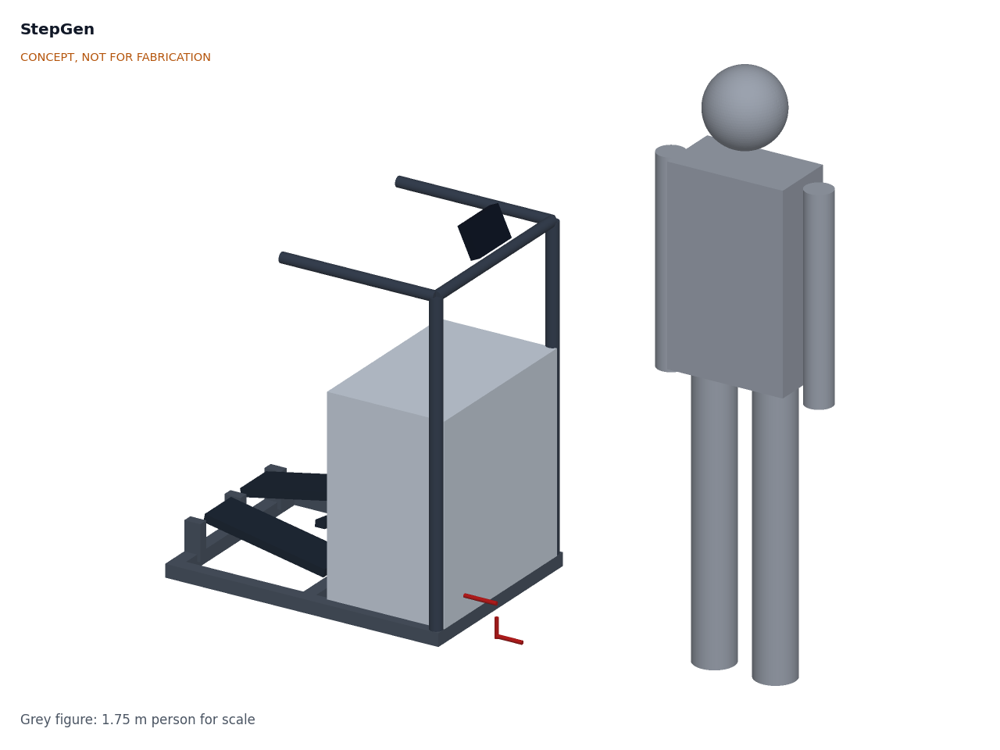

# StepGen

  

**Area:** CleanTech · **TRL:** 2 of 9 (concept formulated) · **Prototype budget:** about $400 USD · **Difficulty:** 3 of 5

Manual stepper generator: the user walks in place on two rocker-linked pedals, one-way clutches turn both strokes into rotation of a flywheel, and a motor running as a generator charges a PowerBox. A realistic output is 40 to 100 W, or about 60 to 100 Wh stored per hour of stepping.

[Interactive 3D model](media/viewer.html) · [Concept blueprint (PDF)](media/concept-blueprint.pdf) · [Review note](docs/REVIEW.md)

## Problem

Homes in rural areas, informal settlements and outage-prone cities lose lights, phone charging and connectivity when the grid fails, and many have no roof space or sun for solar. Pedal generators need a bicycle and riding ability. Design with, not for: requirements must come from co-design sessions and field trials with the intended users through a local partner.

## Concept

Manual stepper generator: the user walks in place on two rocker-linked pedals, one-way clutches turn both strokes into rotation of a flywheel, and a motor running as a generator charges a PowerBox. A realistic output is 40 to 100 W, or about 60 to 100 Wh stored per hour of stepping.

Full design precis: [docs/02-concept.md](docs/02-concept.md)

## Key components

- Steel base and rocker-linked pedals
- Chain or rack drive with one-way clutches (2)
- Flywheel
- BLDC motor used as generator, geared up
- Rectifier and load controller (sets step resistance)
- Display for steps, watts and watt-hours
- Output lead to PowerBox

The working bill of materials is in [bom/bom.csv](bom/bom.csv).

## Safety

> Guard all chains, gears and the flywheel. Pedals need non-slip treads and a handrail. The generator output must stay at safe low voltage (under 60 V DC).

## Repository layout

| Folder | Contents |
| --- | --- |
| `docs/` | Problem, concept, requirements, calculations and design decisions |
| `cad/src/` | build123d Python source, the source of truth for all geometry |
| `cad/step/`, `cad/stl/` | Exported models for FreeCAD, other CAD tools and printing |
| `cad/drawings/` | 2D sketches and dimensioned drawings |
| `bom/` | Bill of materials |
| `electronics/` | KiCad schematics and PCB layouts |
| `firmware/` | Microcontroller code |
| `media/` | Renders, perspectives and photos |
| `build-log/` | Dated prototyping notes |

## Documentation

Controlled documents follow the portfolio [documentation standard](.kit/STANDARDS.md). Each carries a document ID (SGN-PRC-001 for the precis), a version and a revision history. Branded PDFs are built with `python .kit/render.py` and attached to GitHub Releases when a document is tagged, for example `SGN-PRC-001/v1.0`.

## Licenses

- **Hardware** (CAD, drawings, BOM, electronics): [CERN-OHL-S v2](LICENSE)
- **Software** (firmware, scripts, notebooks): [MIT](LICENSE-SOFTWARE)

Part of the open hardware portfolio at [amishchadha.com](https://amishchadha.com).
