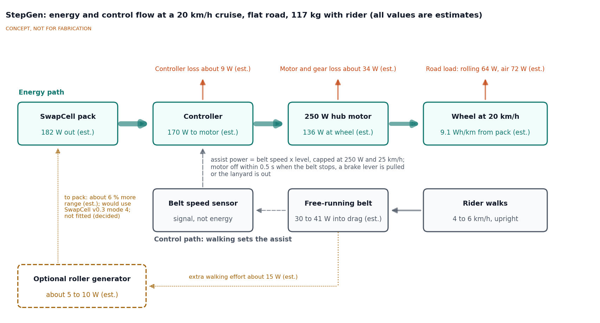
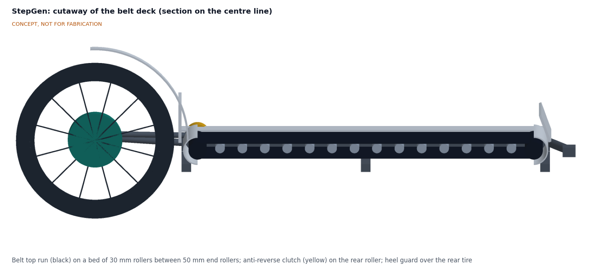
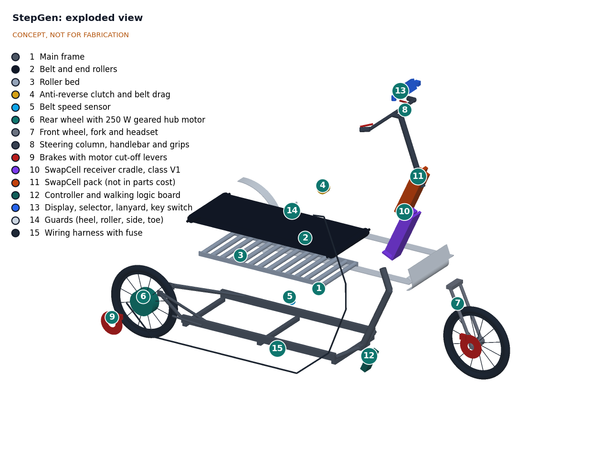

# StepGen design precis

StepGen is a walking-treadmill vehicle. The rider stands upright on a free-running belt (end rollers 1.05 m apart) between two 20 in wheels and walks at an ordinary 4 to 6 km/h; a sensor on the belt roller reads the walking speed, and a 250 W geared hub motor in the rear wheel, powered by a shared SwapCell pack, drives the vehicle at up to 25 km/h. The belt is a control input, not the engine: walking puts only about 30 to 41 W into the belt at 5 km/h, while cruising at 20 km/h needs about 136 W at the wheel. The sizing note SGN-CAL-001 gives about 9.1 Wh/km at 20 km/h, about 45 km on one SwapCell pack on the flat, 34.0 kg without the pack and a parts cost of about $713 excluding the pack, which is over the $650 budget (R12 not met). The general arrangement is drawing SGN-DWG-001 (`cad/drawings/SGN-DWG-001.pdf`), generated from `cad/src/model.py`.

> **Decisions.** Amish decided on 2026-09-24 that StepGen becomes a walking-treadmill vehicle like the Lopifit walking bike: "as the person walks his scooter / bike moves forward but hes upright walking instead of pedalling". The stationary stepper generator of version 0.2 is dropped entirely and no longer charges a PowerBox. On 2026-09-25 Amish accepted the TRL 2 recommendations for form factor, wheels, motor and speed class, range, regeneration, area, budget and legal route, and the move to SwapCell interface v0.3 (SGN-DDR-001). Items still proposed, awaiting Amish, are marked as such.

*Figure 1. StepGen model (`cad/src/model.py`) with a 1.75 m rider standing on the belt mid-stride. Concept, not for fabrication.*

## How it works

1. **Switch on and step on.** The rider turns the key (key switch proposed, awaiting Amish), which closes the SwapCell INTERLOCK loop through its 10 kΩ coding resistor and wakes the pack (interface v0.3 item W). The rider stands on the belt deck, which is 240 mm (9.4 in) above the ground with open sides, holds the handlebar and clips the lanyard stop to a wrist or belt.
2. **Walk.** The rider walks forward at a normal pace. The belt is not powered: the rider's feet push it rearward over a bed of small rollers, the way a non-motorized treadmill works. An anti-reverse clutch on the rear roller lets the belt run only rearward.
3. **Sense.** A Hall sensor on the front roller reads belt speed, which equals walking speed (one pulse per 19.6 mm of belt). The logic board also reads both brake levers, the lanyard switch and the level selector.
4. **Assist.** When the belt has run above 1.5 km/h for 0.5 s, the logic board commands motor power in proportion to belt speed, scaled by the selected level (three levels) and capped at 250 W and 25 km/h. Walking faster asks for more power; walking slower asks for less.
5. **Drive.** The controller drives a 250 W geared hub motor in the 20 in rear wheel from the SwapCell pack at about 39 to 54.6 V.
6. **Stop.** When the rider stops walking, the motor turns off in about 0.26 s; a brake lever or the lanyard cuts it in about 30 ms. Two disc brakes stop the vehicle. The anti-reverse clutch holds the belt, so the rider's feet brace on it as on a scooter deck instead of sliding forward.
7. **Step off and park.** The rider steps sideways off the low deck, puts the kickstand down and turns the key off; the pack opens its output within 1 ms and sleeps.

*Figure 2. Energy and control flow at a 20 km/h cruise on the flat. The energy path runs from the pack to the wheel; walking is on the control path. The optional roller generator (not fitted) is dashed. All values are estimates from SGN-CAL-001.*

*Figure 3. Section through the belt deck on the vehicle centre line.*

## Main components

Numbers match the exploded view and `bom/bom.csv`.

| # | Component | Choice | Notes |
| --- | --- | --- | --- |
| 1 | Main frame | Welded mild steel: 50 x 25 x 2 mm deck rails, cross members, rear stays, nose, 44 mm down tube and head tube | Wheelbase 1.86 m; about 11.4 kg |
| 2 | Belt and end rollers | 400 mm treadmill belt, two 50 mm crowned rollers 1.05 m apart, tensioner at about 500 N per run | Belt top 240 mm above the ground; 1.00 m usable |
| 3 | Roller bed | 14 gravity conveyor rollers, 30 mm, at about 70 mm pitch under the top run | Push about 22 to 30 N; a slider deck would need 78 to 157 N |
| 4 | Anti-reverse clutch and belt drag | Sprag one-way bearing on the rear roller, adjustable drag | Belt runs rearward only; drag sets the feel |
| 5 | Belt speed sensor | Hall sensor and 8-magnet ring on the front roller | The only input that commands assist |
| 6 | Rear wheel with 250 W geared hub motor | 48 V 250 W geared hub wound for a 20 in wheel (about 400 rpm no-load at 48 V), torque arms | Decided by Amish, 2026-09-25 |
| 7 | Front wheel, fork and headset | 20 in wheel, steel disc fork with 30 mm offset, 70° head angle | Trail 58 mm |
| 8 | Steering column, handlebar and grips | 38 x 2 mm steel column to a 1.23 m bar height (0.99 m above the belt), 580 mm bar | Sized for a 500 N push at the bar; height adjustable after co-design |
| 9 | Brakes with motor cut-off levers | Two mechanical disc brakes, 160 mm rotors, cut-off switches in both levers | |
| 10 | SwapCell receiver cradle, class V1 | Steel cradle on the down tube with guide faces, end stop, latch catch, floating receptacle, over-centre lever with detent (330 N preload or more) and a 10 kΩ INTERLOCK coding resistor | SwapCell interface v0.3 items V and W |
| 11 | SwapCell pack | 13S2P, about 46.8 V nominal, about 468 Wh, 2.85 kg | Shared; priced once in the SwapCell BOM, not in the StepGen parts cost |
| 12 | Controller and walking logic board | 48 V, 15 A sine-wave controller; ESP32 with CAN, which is also the SwapCell host | Logic is a labeled sketch only |
| 13 | Display, level selector, lanyard stop, key switch | Speed, level and charge display; magnetic lanyard switch; key switch in the INTERLOCK loop | Key switch proposed, awaiting Amish |
| 14 | Guards | Heel guard and fender over the rear tire, roller end covers, side boards, toe guard | See Safety |
| 15 | Wiring harness with fuse | Keyed waterproof connectors, 20 A fuse | |

*Figure 4. Exploded view with BOM numbers. Item 16 (hardware and kickstand) has no callout.*

## Key numbers

All values come from the sizing note SGN-CAL-001 (`docs/04-calcs/sizing.py`), which uses the geometry of `cad/src/model.py`. They are paper estimates, not measurements. Main assumptions: rider 80 kg, vehicle 34.0 kg, SwapCell pack 2.85 kg, total 116.8 kg; rolling resistance coefficient 0.010; standing rider drag area CdA 0.70 m²; air density 1.2 kg/m³; motor and gearbox 80 % and controller 95 % efficient; 3 W auxiliary load; usable pack energy 411 Wh (457 Wh at the terminals per cycle, 10 % reserve); roller-bed coefficient 0.02.

*Table 1. Key numbers.*

| Quantity | Value | Basis | Requirement |
| --- | --- | --- | --- |
| Walking speed on the belt | 4 to 6 km/h (2.5 to 3.7 mph) | Normal adult walking pace | R1 |
| Vehicle speed | Up to 25 km/h (15.5 mph); 15 km/h beginner mode; about 20 km/h typical cruise | Assist cut-off set in firmware; road load equals 250 W at 26.4 km/h | R3 met on paper |
| Motor power | 250 W rated; 136 W at the wheel at 20 km/h and 220 W at 25 km/h | Road load: rolling 0.010 x 116.8 kg x 9.81 x v, plus air 0.5 x 1.2 x 0.70 x v³ | R4 met on paper |
| Pack power and current | 182 W and 3.9 A at 20 km/h; 293 W and 6.3 A at 25 km/h; at most 8.5 A at 39 V; 15 A controller limit | Wheel power over 0.80 x 0.95, plus 3 W | R11 met on paper |
| Energy per km | 7.1 Wh/km at 15 km/h, 9.1 Wh/km at 20 km/h, 11.7 Wh/km at 25 km/h | Pack power over speed, flat, steady, no wind | |
| Range on one SwapCell pack | 58 km at 15 km/h, 45 km at 20 km/h, 35 km at 25 km/h on the flat; about 32 km at 20 km/h in real use | 411 Wh usable; real use x 1.4 energy | R5 (30 km at 20 km/h) met |
| Hill | 8 % at 8 km/h needs 233 W at the wheel (25.9 N m); at 250 W the vehicle climbs 5 % at 12.2 km/h and 10 % at 7.1 km/h | Grade plus road load | R6 at risk (7 % margin) |
| Acceleration | Limited to 1.0 m/s² by a 32 N m torque limit; 0 to 20 km/h in about 12 s | 250 W cap | R3 met on paper |
| Mass | 34.0 kg without the pack, 36.8 kg with it | Table 2 of SGN-CAL-001 | R10 at risk (3.2 kg margin) |
| Size | 2.35 m long, 0.61 m wide at the grips, 1.31 m high; wheelbase 1.86 m | Model | R10 met on length and width |
| Belt | End rollers 1.05 m apart, 1.00 m usable, 400 mm wide, top 240 mm above the ground; 148 mm ground clearance | Model | R1 at risk, R8 met |
| Rider push and power into the belt | 21.7 to 29.7 N at 5 km/h, or 30 to 41 W, all dissipated as belt drag | Roller bed 0.02 x 80 kg x 9.81 = 15.7 N, plus bending, bearings and the 0 to 8 N drag setting | R1 |
| Rider effort | About 250 to 350 W metabolic, light exercise similar to ordinary walking | About 3 to 3.5 MET for an 80 kg adult | |
| Motor off | 261 ms after the belt stops; about 30 ms from a brake lever or the lanyard | Timing budget | R2 met on paper |
| Braking | 8.0 m from 25 km/h at 3 m/s²; rear brake alone 9.6 m, front alone 4.5 m | v² / 2a with load transfer | R7 met on paper |
| Steering | 70° head angle, 30 mm fork offset, 58 mm trail; 30° lean clearance | Model | |
| Optional roller generator (not fitted) | 5 to 10 W to the pack in SwapCell mode 4 for about 15 W of extra walking effort; about 6 % more range | Small BLDC at about 60 % from belt to pack | Decided: not in the first concept |
| Parts cost | $713 excluding the pack; about $538 on the salvage route | `bom/bom.csv` | R12 **not met** ($650) |

### Why the motor does the work

Walking on the belt delivers about 30 to 41 W at 5 km/h, and all of it is spent pushing the belt over its rollers. Even if a mechanical drive delivered 40 W to the wheel with no loss at all, road load would limit the vehicle to 9.9 km/h on flat pavement, and it would stall on a 3 % grade, which needs 65 W at 5 km/h. After drivetrain losses, walking pace is the realistic result. This matches reports from mechanical treadmill-bike builders ([SolidSmack](https://www.solidsmack.com/design/evolution-unusual-treadmill-bicycle/)). The Lopifit also drives its wheel with a 250 W motor, not with the belt ([New Atlas](https://newatlas.com/urban-transport/lopifit-electric-scooter-treadmill-bike-walking/)).

### Assist law (sketch, not firmware)

A labeled sketch of the control rule. It is not firmware, and no firmware is written at TRL 3:

- Assist power P = k(level) x v_belt, with k chosen so that walking at 5 km/h gives about 100, 175 or 250 W at levels 1, 2 and 3. Power is capped at 250 W and tapered to zero between 23 and 25 km/h (15 km/h in beginner mode).
- Drive force is limited to 128 N (31.7 N m at the hub), so acceleration from rest is 1.0 m/s² or less, and the power command ramps at no more than about 100 W/s, so the vehicle cannot surge ahead of the rider. The 250 W cap leaves 0.64 m/s² at 10 km/h and 0.18 m/s² at 20 km/h.
- Assist is off unless the belt has run above 1.5 km/h for 0.5 s (11 sensor pulses). A stop is declared after three missed pulse periods (141 ms), and the motor is off 261 ms after the belt stops. The brake-lever and lanyard switches cut the controller directly, in about 30 ms.

### SwapCell interface

StepGen builds to **SwapCell interface v0.3** unchanged (SWC-PRC-001 v0.3, SWC-DDR-001), as Amish decided on 2026-09-25 (SGN-DDR-001 item 9):

- **Wake, item W.** The receiver cradle fits a 10 kΩ ±1 % coding resistor between INTERLOCK and SGND, which holds the pack's sense node at 0.30 V (accepted window 0.24 to 0.37 V) and wakes a sleeping pack with no supply from the vehicle. The WAKE pin is not used. Proposed, awaiting Amish: a key switch in series with the resistor, so that key off opens the loop, the pack cuts its output within 1 ms and sleeps (about 0.72 % of charge per month), and key on wakes it again.
- **Heartbeat.** The ESP32 logic board is the SwapCell host: host type 0 (vehicle), requested mode 2 (discharge), host discharge limit 15.0 A. The CAN bit layout is now defined in v0.3, but the message handling stays a labeled sketch because firmware is beyond TRL 3.
- **Charge-discharge, item C.** Not used. The geared hub freewheels, so there is no regenerative braking, and the roller generator is not fitted (SGN-DDR-001 item 5). If the generator is studied later, it would request mode 4 with a host charge limit of about 0.2 A.
- **Latch class V1, item V.** The cradle on the down tube is a vehicle receiver to class V1: it holds the pack with no release and no power-contact break of 1 ms or longer under 8 g sine vibration and 25 g shocks. An over-centre lever with a detent preloads the pack against its end stop with 330 N or more (ratio 6.6 at a 50 N hand force), and the pack's own latch carries a 1.72 kN proof load. The cradle leaves the pack's back and lid faces open to air, as v0.3 asks, and leaves the flush wake button reachable. Retention can only be shown by test (R13, TRL 4, on hold).
- **Current.** The pack supplies 3.9 A at a 20 km/h cruise and at most 8.5 A, inside the 15 A legacy limit and far from the 20 A case that puts the pack's thermal rating at risk.
- **Flag to the SwapCell project.** The logic board is powered from the pack output, so after a key-on wake the pack enters legacy discharge (no heartbeat within 2 s) before the board can send a heartbeat. The v0.3 behavior rules do not say whether a pack in legacy discharge moves to mode 2 when a heartbeat arrives. StepGen raises this with the SwapCell project and does not change the interface locally.

## Key design choices

Amish decided the change to a walking vehicle on 2026-09-24 and the choices marked "decided" on 2026-09-25 (SGN-DDR-001). Choices marked "proposed" await Amish. Unmarked choices (rear drive, roller bed, anti-reverse clutch, pack position) are engineering choices supported by SGN-CAL-001; Amish can revisit any of them.

- **Form factor: two-wheel, long wheelbase, bike type.** Decided. A walking step at 5 km/h is about 0.7 m for a 1.75 m rider, so with the foot the belt needs about 1.0 m of usable length. That sets a long wheelbase (1.86 m). SGN-CAL-001 shows that 1.0 m is short for taller riders or 6 km/h; a longer belt is proposed, awaiting Amish, because it trades against the 2.4 m length limit. Two wheels keep the vehicle narrow for cycle lanes and doors. Alternatives: (a) a compact scooter type with 12 to 16 in wheels and a belt of about 0.7 m, which is shorter and lighter but forces short shuffling steps and copes poorly with rough surfaces; (b) a three-wheel tadpole version with two front wheels, which stands up on its own and suits riders without two-wheel balance, but is wider (about 0.75 m), heavier and less stable in fast turns with a standing rider. Decided by Amish, 2026-09-25: two wheels for the first concept, with the three-wheel version kept open until co-design shows whether non-cyclists can balance.
- **Wheels: 20 in (ETRTO 406) front and rear.** Decided. One tire size, a low deck, common parts. Alternatives: a 28 in front wheel like the Lopifit (rolls better over rough ground, longer vehicle), or 16 in wheels (shorter, harsher ride).
- **Motor and speed class: 250 W rated rear geared hub, assist cut at 25 km/h, 15 km/h beginner mode.** Decided, because it stays within EU pedelec limits and a standing rider has high drag and a high centre of mass. Alternatives: a US class 1 style limit of 20 mph (32 km/h) with a 500 to 750 W motor (more hill ability, more risk for a standing rider, and not legal as a pedelec in the EU), or a lower 20 km/h cap throughout.
- **Rear drive, not front.** The rider's weight sits mostly over the rear half of the deck, which gives the rear wheel traction, and the steering stays light. Alternative: a front hub motor as in SunSpoke (simpler wiring, but a light front wheel can spin on wet surfaces).
- **Roller bed rather than a slider deck.** A slider deck (belt on a waxed board) has a friction coefficient of about 0.1 to 0.2, which would need about 80 to 160 N of push from an 80 kg rider. A roller bed cuts this to about 15 to 30 N.
- **Anti-reverse clutch on the belt.** Lets the rider brace against the belt when braking. Without it, a free belt would let the feet slide forward under deceleration.
- **Pack on the down tube, ahead of the rider's feet.** Keeps the pack clear of the stride and easy to swap from the side. Alternatives: under the deck (too little ground clearance) or on the steering column (heavier steering).
- **Regeneration from the belt: not in the first concept.** Decided. It would return only about 5 to 10 W, costs about $35 to $50 and makes walking harder. SwapCell v0.3 now has the charge-discharge mode it would need, but that does not change the balance. A mounting point on the front roller stays for a later study.
- **Steering geometry: 30 mm fork offset and 38 x 2 mm column (TRL 3).** Without offset the 70° head gave about 90 mm of trail, heavy for a 20 in wheel; 30 mm of offset gives 58 mm. A 32 mm column would reach a factor of only 1.4 on yield under a 500 N push at the bar.
- **Deck rails: 50 x 25 x 2 mm (proposed change to 60 x 30 x 2 mm).** Static strength is ample (factor 2.0), but the walking stress range at the welds (37.6 MPa) is at the fatigue limit (38.8 MPa). The larger rails cut it to 25.5 MPa for 1.08 kg. Proposed, awaiting Amish, because it uses a third of the mass margin.

## Safety

> **Safety:** StepGen is a moving vehicle with a moving belt that a person stands on, driven by a 468 Wh lithium-ion pack at up to 54.6 V DC. Every hazard below needs a design control before any build.

- **Falls on a moving belt.** A rider who trips or stops walking abruptly on a belt can fall. Controls: the belt is free-running, so it stops when the rider stops; the motor turns off within 0.5 s when the belt stops; handlebar at about hip-to-waist height; non-slip belt surface; low deck (240 mm) with open sides so a foot can go down. The dynamics of a rider who stumbles while the vehicle coasts at 20 km/h need a proper study at TRL 3.
- **Dead-man and lanyard cut-off.** A magnetic lanyard clipped to the rider cuts motor power if the rider leaves the deck. Handle sensors like those on the Lopifit ([Lopifit](https://www.lopifit.com/what-is-a-lopifit/)) are an option to study.
- **Braking with feet on a belt.** Under braking the rider's body pushes forward. The anti-reverse clutch stops the belt moving forward, so the feet can brace; the toe guard gives a stop. Braking at about 3 m/s² asks an 80 kg rider to resist about 240 N, which the legs and arms can share. Harder stops risk pitching the rider over the bar, so brake modulation and bar height need checking.
- **Pinch and entanglement.** In-running nips where the belt meets each end roller can trap toes, fingers and clothing, and the rear tire runs close behind the heel. Controls: roller end covers, side boards over the belt edges, a heel guard and fender over the rear tire, and spoke guards. Guard gaps follow ISO 13857 reach distances. Long skirts and laces are a specific risk to check in co-design.
- **Speed.** Assist is cut at 25 km/h and a beginner mode limits it to 15 km/h. Acceleration is limited so the vehicle cannot pull away from the rider.
- **Helmet.** Riders should wear a bicycle helmet. A standing rider's head is about 2 m above the ground, higher than on a bicycle, so a fall is from a greater height.
- **Stability.** A standing rider raises the centre of mass. Tip-over in turns, on cross-slopes and when stepping on or off must be checked at TRL 3, and a kickstand is needed so the vehicle does not fall when parked.
- **Electrical and battery.** Every circuit stays below 60 V DC. The SwapCell pack's BMS, coded interlock and warn-then-derate behavior apply; a sudden loss of power at speed is less dangerous here than a sudden surge, but both are covered by the ramp limit. A 20 A fuse protects the harness. Packs are charged only in a SwapCell dock, never on the vehicle. Turning the key off opens the INTERLOCK loop and cuts the pack output at once, without warn-then-derate, so the key is for use at a standstill only; the lanyard and brake levers cut only the motor.
- **Pack retention.** A pack that leaves its cradle at speed is a 2.85 kg projectile with live contacts. The class V1 receiver, the over-centre lever with its detent and the pack latch must all be in place before riding.
- **Legal use.** Until the legal category is known, StepGen should be used only where the rules allow it.

## Open questions

TRL 3 is the hard stop by Amish's instruction. These questions stay open; the ones that need a test belong to TRL 4, which is on hold.

- Legal category of a pedal-less walking vehicle in the first target country (country proposed, awaiting Amish).
- Can non-cyclists balance a two-wheeled walking vehicle, or does the first prototype need three wheels? (Co-design; partner open.)
- Belt length for tall riders and brisk walking against the 2.4 m length limit (proposed, awaiting Amish).
- Belt drag and walking feel: roller spacing, drag setting and the real roller-bed coefficient (needs a test).
- Rider dynamics when stumbling, stopping walking abruptly or braking hard; bar height and handle position (co-design and test).
- Weld fatigue of the deck rails (proposed rail change) and frame stiffness under a standing load.
- Guard gaps against ISO 13857 (R9) and pack retention to class V1 (R13), which need hardware.
- Legacy-to-heartbeat transition in the SwapCell behavior rules (flagged to the SwapCell project).
- Cost: $713 against $650 (options in the review note).

Drawings and media: [general arrangement SGN-DWG-001](../cad/drawings/SGN-DWG-001.pdf), [concept blueprint sheet SGN-DWG-010](../media/concept-blueprint.pdf), [interactive 3D model](../media/viewer.html). Model source: `cad/src/model.py` (STEP files in `cad/step/`).
